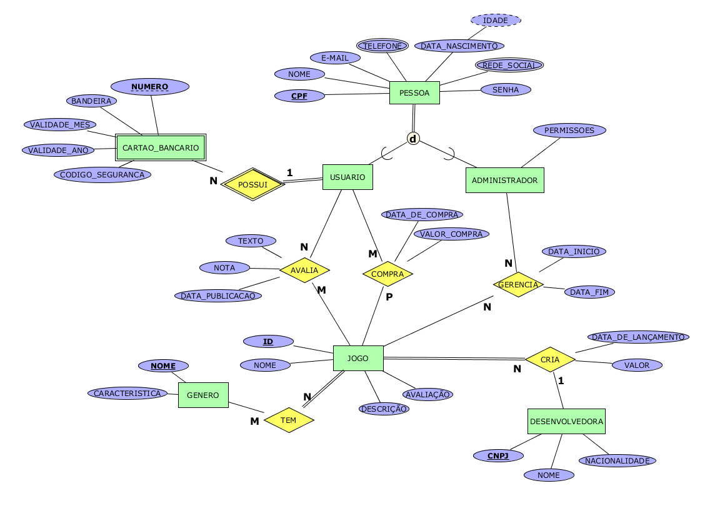

# 🎮 MAETS GameStore - Sistema Completo de Loja de Jogos

Projeto acadêmico da disciplina **Banco de Dados I**, implementando um **sistema de loja de jogos digitais**.  
O sistema foi construído a partir do **modelo ERE corrigido do TP1** e entregue conforme as exigências do **TP2**.

---

## 📖 Mini Mundo



A **GameStore** é uma plataforma digital de venda de jogos eletrônicos.  
No sistema, existem **usuários comuns** e **administradores**.  

- Usuários podem:
  - Cadastrar dados pessoais e cartões bancários.
  - Comprar jogos.
  - Avaliar os jogos adquiridos.
  - Consultar seu histórico de compras.

- Administradores podem:
  - Cadastrar e gerenciar jogos.
  - Gerenciar usuários.
  - Acompanhar o desempenho das vendas.

- Desenvolvedoras possuem **CNPJ** e são responsáveis pelos jogos publicados.  
- Cada jogo possui informações de **nome, gênero, descrição, data de lançamento, valor**.  
- Compras geram registros financeiros.  
- Avaliações são feitas apenas após a compra.  
- Curiosidades extras sobre jogos também podem ser cadastradas.  

---

## 📚 Dicionário de Dados

| Entidade            | Atributo             | Tipo          | PK | FK | Descrição |
|---------------------|----------------------|--------------|----|----|-----------|
| **pessoa**          | cpf                  | VARCHAR(11)  | ✔  |    | Identificador único |
|                     | nome                 | TEXT         |    |    | Nome completo |
|                     | email                | TEXT         |    |    | E-mail válido |
|                     | telefone             | TEXT         |    |    | Telefone |
|                     | data_nascimento      | DATE         |    |    | Data de nascimento |
|                     | rede_social          | TEXT         |    |    | Rede social |
|                     | senha_hash           | TEXT         |    |    | Senha criptografada |
| **usuario**         | cpf                  | VARCHAR(11)  | ✔  | FK | Especialização de pessoa |
| **administrador**   | cpf                  | VARCHAR(11)  | ✔  | FK | Especialização de pessoa |
|                     | permissoes           | TEXT         |    |    | Lista de permissões |
| **desenvolvedora**  | cnpj                 | VARCHAR(14)  | ✔  |    | Identificador único |
|                     | nome                 | TEXT         |    |    | Nome da desenvolvedora |
|                     | nacionalidade        | TEXT         |    |    | País de origem |
| **jogo**            | id                   | SERIAL       | ✔  |    | Identificador |
|                     | nome                 | TEXT         |    |    | Nome do jogo |
|                     | descricao            | TEXT         |    |    | Sinopse |
|                     | data_lancamento      | DATE         |    |    | Data de lançamento |
|                     | valor                | NUMERIC(10,2)|    |    | Preço do jogo |
|                     | id_desenvolvedora    | VARCHAR(14)  |    | FK | Desenvolvedora |
| **genero**          | id                   | SERIAL       | ✔  |    | Identificador |
|                     | nome                 | VARCHAR(50)  |    |    | Nome do gênero |
|                     | caracteristica       | TEXT         |    |    | Descrição do gênero |
| **jogo_genero**     | id_jogo              | INT          | ✔  | FK | Jogo |
|                     | id_genero            | INT          | ✔  | FK | Gênero |
| **cartao_bancario** | id_usuario           | VARCHAR(11)  | ✔  | FK | Dono do cartão |
|                     | numero               | TEXT         | ✔  |    | Número do cartão |
|                     | bandeira             | TEXT         |    |    | Visa, Master etc |
|                     | validade_mes         | INT          |    |    | Mês de expiração |
|                     | validade_ano         | INT          |    |    | Ano de expiração |
|                     | codigo_seguranca     | INT          |    |    | CVV |
| **compra**          | id_usuario           | VARCHAR(11)  | ✔  | FK | Usuário comprador |
|                     | id_jogo              | INT          | ✔  | FK | Jogo comprado |
|                     | data_compra          | TIMESTAMP    |    |    | Data e hora |
|                     | valor_pago           | NUMERIC(10,2)|    |    | Valor da compra |
| **avalia**          | id_usuario           | VARCHAR(11)  | ✔  | FK | Usuário avaliador |
|                     | id_jogo              | INT          | ✔  | FK | Jogo avaliado |
|                     | nota                 | INT          |    |    | 0 a 10 |
|                     | texto                | TEXT         |    |    | Comentário |
|                     | data_publicacao      | DATE         |    |    | Data da avaliação |
| **gerencia**        | id_admin             | VARCHAR(11)  | ✔  | FK | Admin responsável |
|                     | id_jogo              | INT          | ✔  | FK | Jogo |
|                     | data_inicio          | DATE         |    |    | Início da gestão |
|                     | data_fim             | DATE         |    |    | Fim da gestão |
| **cria**            | cnpj                 | VARCHAR(14)  | ✔  | FK | Desenvolvedora |
|                     | id_jogo              | INT          | ✔  | FK | Jogo |
|                     | data_lancamento      | DATE         |    |    | Data oficial |
|                     | valor                | NUMERIC(10,2)|    |    | Preço |
| **contrata**        | cnpj                 | VARCHAR(14)  | ✔  | FK | Desenvolvedora |
|                     | id_admin             | INT          | ✔  | FK | Admin responsável |


---

## 🏗️ Modelo Relacional

- pessoa(`cpf`, nome, email, telefone, data_nascimento, rede_social, senha_hash)  
- usuario(`cpf` FK→pessoa)  
- administrador(`cpf` FK→pessoa, permissoes)  
- desenvolvedora(`cnpj`, nome, nacionalidade)  
- jogo(`id`, nome, descricao, data_lancamento, valor, id_desenvolvedora FK→desenvolvedora)
- genero(`id`, nome, caracteristica)
- jogo_genero(`id_jogo` FK→jogo, `id_genero` FK→genero)
- cartao_bancario(`id_usuario` FK→usuario, `numero`, bandeira, validade_mes, validade_ano, codigo_seguranca)  
- compra(`id_usuario` FK→usuario, `id_jogo` FK→jogo, data_compra, valor_pago)  
- avaliacao(`id_usuario` FK→usuario, `id_jogo` FK→jogo, nota, texto, data_publicacao)  
- gerencia(`id_admin` FK→administrador, `id_jogo` FK→jogo, data_inicio, data_fim)  
- cria(`cnpj`, `id_jogo`, data_lancamento, valor)
- contrata(`cnpj`, `id_admin`)

---

## 💾 Esquema Físico (DDL SQL)

O esquema físico completo está nos arquivos:

- `sql/01_schema.sql` → tabelas  
- `sql/02_constraints_indices_triggers.sql` → constraints, índices, triggers  
- `sql/03_views.sql` → views  
- `sql/04_seed.sql` → dados de teste  
- `sql/05_queries_algebra.sql` → consultas demonstrativas  
- `CONSULTAS_EXEMPLO.md` → exemplos de consultas SQL  
- `insomnia_collection.json` → coleção para testes da API  

---

## 🔍 Consultas SQL (Álgebra Relacional)

O arquivo `sql/05_queries_algebra.sql` contém 15 consultas demonstrativas.  
Abaixo, exemplos prontos para copiar:

### 1. Seleção (σ) — Jogos que custam mais de R$100
```sql
SELECT j.id, j.nome, j.valor, j.data_lancamento
FROM jogo j 
WHERE j.valor > 100;
```

### 2. Projeção (π) — Nomes e emails dos usuários cadastrados
```sql
SELECT p.nome, p.email 
FROM pessoa p
JOIN usuario u ON p.cpf = u.cpf;
```

### 3. Junção (⨝) — Jogos com seus gêneros e desenvolvedoras
```sql
SELECT j.nome AS jogo, 
       STRING_AGG(DISTINCT g.nome, ', ') AS generos,
       d.nome AS desenvolvedora
FROM jogo j
JOIN desenvolvedora d ON j.id_desenvolvedora = d.cnpj
LEFT JOIN jogo_genero jg ON j.id = jg.id_jogo
LEFT JOIN genero g ON jg.id_genero = g.id
GROUP BY j.id, j.nome, d.nome;
```

### 4. Agregação (GROUP BY / HAVING) — Média de avaliações por jogo
```sql
SELECT j.nome, 
       ROUND(AVG(a.nota), 2) AS media_avaliacao,
       COUNT(a.nota) AS total_avaliacoes
FROM jogo j
JOIN avaliacao a ON j.id = a.id_jogo
GROUP BY j.id, j.nome
HAVING AVG(a.nota) >= 8;
```

### 5. Operação de conjunto (∪) — Jogos de RPG ou Ação
```sql
SELECT DISTINCT j.nome 
FROM jogo j
JOIN jogo_genero jg ON j.id = jg.id_jogo
JOIN genero g ON jg.id_genero = g.id
WHERE g.nome = 'RPG'
UNION
SELECT DISTINCT j.nome 
FROM jogo j
JOIN jogo_genero jg ON j.id = jg.id_jogo
JOIN genero g ON jg.id_genero = g.id
WHERE g.nome = 'Ação';
```

### 6. Subconsulta (EXISTS) — Usuários que compraram pelo menos um jogo
```sql
SELECT p.nome, p.email
FROM pessoa p
JOIN usuario u ON p.cpf = u.cpf
WHERE EXISTS (
  SELECT 1 FROM compra c WHERE c.id_usuario = u.cpf
);
```

### 7. Divisão relacional — Usuários que compraram todos os jogos de RPG
```sql
SELECT p.nome
FROM pessoa p
JOIN usuario u ON p.cpf = u.cpf
WHERE NOT EXISTS (
  SELECT j.id
  FROM jogo j
  JOIN jogo_genero jg ON j.id = jg.id_jogo
  JOIN genero g ON jg.id_genero = g.id
  WHERE g.nome = 'RPG'
  EXCEPT
  SELECT c.id_jogo
  FROM compra c
  WHERE c.id_usuario = u.cpf
);
```

### 8. Funções de janela (RANK) — Ranking dos jogos mais bem avaliados
```sql
SELECT j.nome, 
       ROUND(AVG(a.nota), 2) AS media,
       RANK() OVER (ORDER BY AVG(a.nota) DESC) AS posicao
FROM jogo j
JOIN avaliacao a ON j.id = a.id_jogo
GROUP BY j.id, j.nome
ORDER BY media DESC;
```

### 9. Junção Externa (LEFT JOIN) — Todos os jogos com suas avaliações (incluindo sem avaliação)
```sql
SELECT j.nome,
       COALESCE(ROUND(AVG(a.nota), 2), 0) AS media_avaliacao,
       COUNT(a.nota) AS total_avaliacoes
FROM jogo j
LEFT JOIN avaliacao a ON j.id = a.id_jogo
GROUP BY j.id, j.nome
ORDER BY media_avaliacao DESC;
```

### 10. Subconsulta correlacionada — Jogos com preço acima da média
```sql
SELECT j.nome, j.valor
FROM jogo j
WHERE j.valor > (
  SELECT AVG(valor) FROM jogo
)
ORDER BY j.valor DESC;
```

### 11. Interseção (∩) — Jogos comprados E avaliados por um usuário
```sql
SELECT j.nome
FROM jogo j
WHERE j.id IN (
  SELECT c.id_jogo FROM compra c WHERE c.id_usuario = '12345678901'
  INTERSECT
  SELECT a.id_jogo FROM avaliacao a WHERE a.id_usuario = '12345678901'
);
```

### 12. Diferença (−) — Jogos comprados mas não avaliados
```sql
SELECT j.nome
FROM jogo j
WHERE j.id IN (
  SELECT c.id_jogo FROM compra c WHERE c.id_usuario = '12345678901'
  EXCEPT
  SELECT a.id_jogo FROM avaliacao a WHERE a.id_usuario = '12345678901'
);
```

---

## 🚀 Como Executar

```bash
git clone <url-do-repositorio>
cd BD\ trabalho\ final
```

### Usando Docker Compose

1. Inicie os serviços

```bash
docker-compose up -d
```
Este comando irá:

  - Criar e inicializar o banco PostgreSQL
  - Executar automaticamente os scripts SQL na ordem correta
  - Construir e iniciar a API
  - Construir e iniciar o frontend

2. Aguarde a inicialização

  - O banco de dados será inicializado com todos os dados de teste
  - A API estará disponível em: `http://localhost:3001`
  - O frontend estará disponível em: `http://localhost:3000`

3. Acesse o pgAdmin (Administração do Banco)

- **URL**: `http://localhost:8080`
- **Email**: `admin@gamestore.com`
- **Senha**: `admin123`

**Para conectar ao banco no pgAdmin:**
1. Clique em "Add New Server"
2. **General Tab**: Name = "GameStore DB"
3. **Connection Tab**:
   - Host: `db`
   - Port: `5432`
   - Database: `gamestore`
   - Username: `postgres`
   - Password: `postgres`

### Usando PostgreSQL + pgAdmin

1. **Crie o banco `gamestore`** no PostgreSQL:
   ```sql
   CREATE DATABASE gamestore;
   ```

2. **Abra o pgAdmin**, conecte ao servidor e selecione o banco `gamestore`.

3. **Execute os scripts na ordem**:
   - `01_schema.sql` → cria tabelas  
   - `02_constraints_indices_triggers.sql` → adiciona constraints, índices e triggers  
   - `03_views.sql` → cria views (inclua views no **plural** se a API esperar, ex.: `CREATE VIEW jogos AS SELECT * FROM jogo;`)  
   - `04_seed.sql` → insere dados de teste  

4. **Testes rápidos**:
   ```sql
   -- Listar tabelas/views
   \dt+

   -- Conferir dados
   SELECT COUNT(*) FROM jogo;
   SELECT COUNT(*) FROM compra;
   SELECT COUNT(*) FROM avaliacao;

   -- Caso use views no plural
   SELECT COUNT(*) FROM jogos;
   ```

5. **Subir a API (sem Docker)**:
   ```bash
   cd api
   # .env (ajuste <usuario>):
   # DATABASE_URL=postgresql://<usuario>@localhost:5432/gamestore
   npm install
   npm run dev
   ```

6. **Subir o Frontend (sem Docker)**:
   ```bash
   cd ../web
   # .env.local
   # NEXT_PUBLIC_API_URL=http://localhost:3001
   npm install
   npm run dev
   ```

---

## 👥 Usuários de Teste

### Usuários Comuns

  - **Email**: `ana.silva@email.com` | **Senha**: `senha123`
  - **Email**: `bruno.santos@email.com` | **Senha**: `senha123`
  - **Email**: `carla.oliveira@email.com` | **Senha**: `senha123`

### Administradores

  - **Email**: `admin.master@gamestore.com` | **Senha**: `admin123` (todas as permissões)
  - **Email**: `admin.jogos@gamestore.com` | **Senha**: `admin123` (gerenciar jogos)
  - **Email**: `admin.users@gamestore.com` | **Senha**: `admin123` (gerenciar usuários)

## 📝 Notas de Implementação

### Estrutura do Projeto

- `api/` → Backend Node.js com Express e Prisma
- `web/` → Frontend Next.js com TypeScript
- `sql/` → Scripts SQL do banco de dados
- `docker-compose.yml` → Orquestração dos serviços
- `insomnia_collection.json` → Coleção para testes da API
- `CONSULTAS_EXEMPLO.md` → Exemplos de consultas SQL

### Decisões Técnicas

  - **Prisma ORM**: Escolhido pela type-safety e facilidade de uso
  - **JWT**: Para autenticação stateless
  - **Tailwind CSS**: Para estilização rápida e consistente
  - **Zod**: Para validação de dados tanto no frontend quanto no backend
  - **Docker**: Para facilitar o *deployment* e desenvolvimento

### Conformidade com Requisitos

  - ✅ Modelo ERE corrigido implementado
  - ✅ Mapeamento relacional completo
  - ✅ Constraints e triggers funcionais
  - ✅ API REST segura
  - ✅ Frontend moderno e funcional
  - ✅ Docker Compose com 3 serviços
  - ✅ Dados de teste realistas
  - ✅ Consultas de Álgebra Relacional
  - ✅ README com instruções completas


